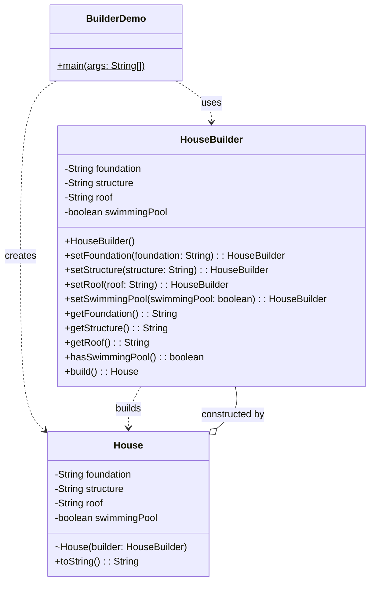
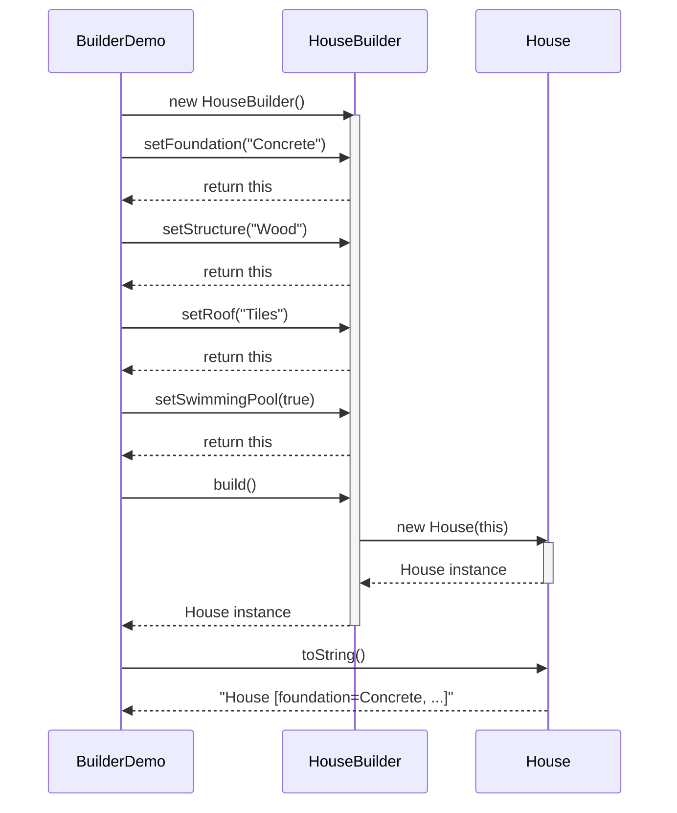
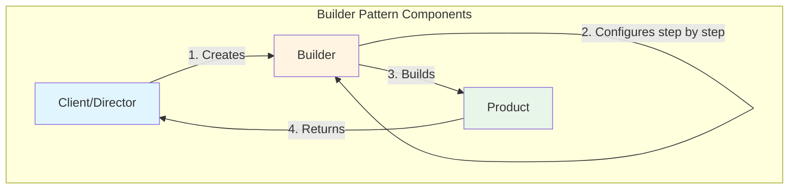
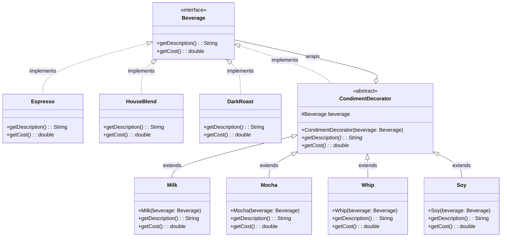
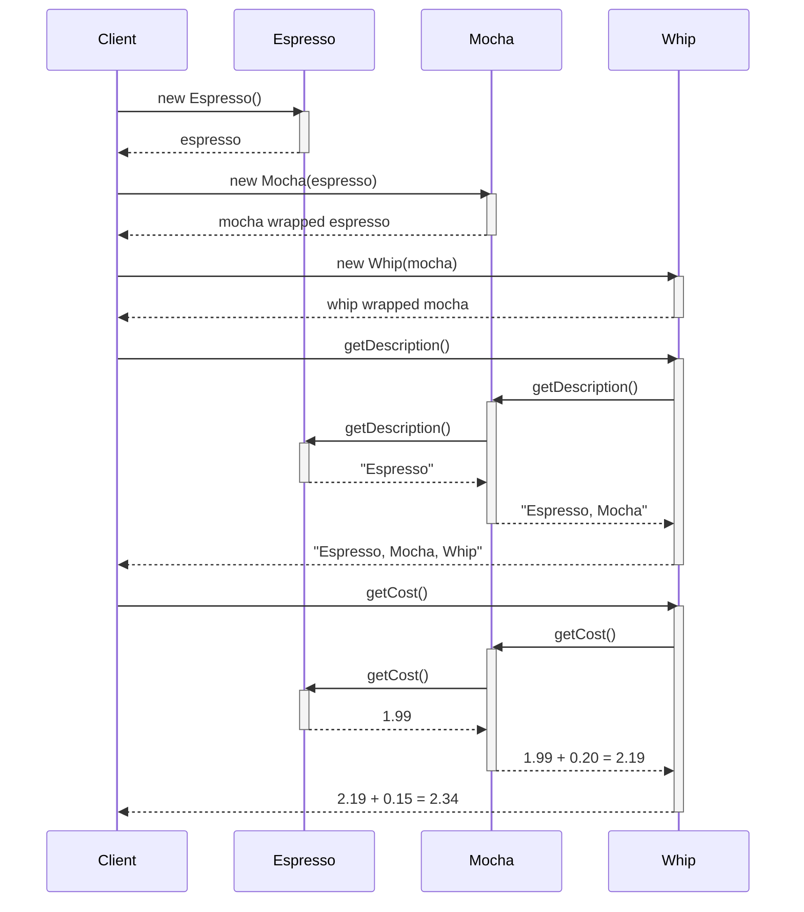
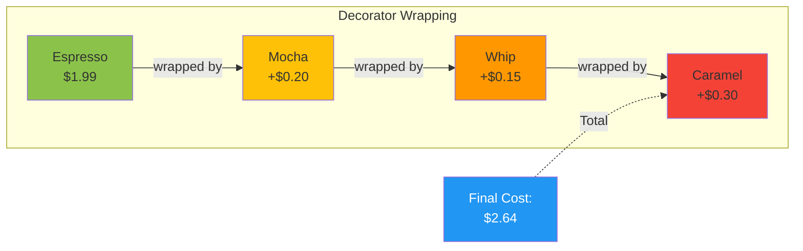
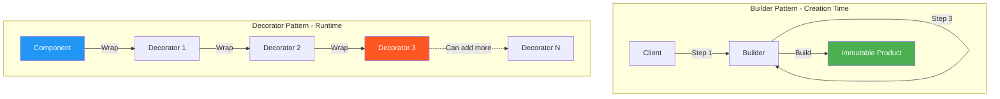
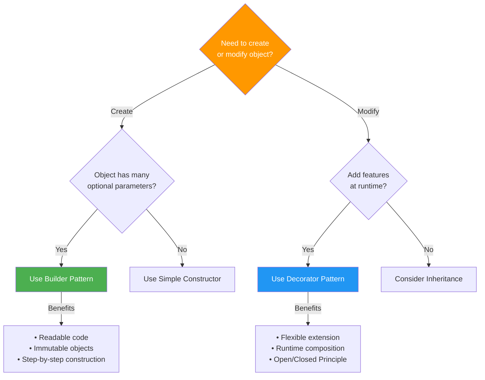
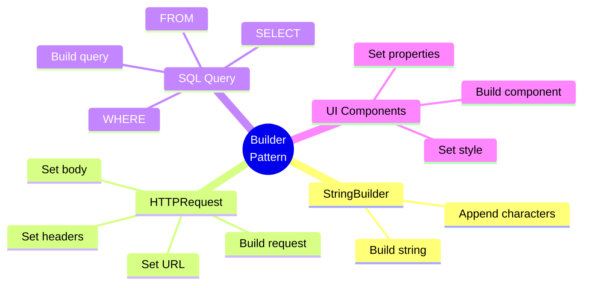
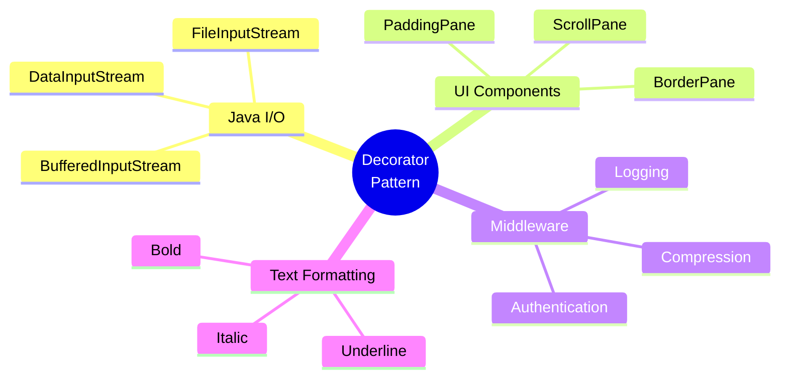

# Builder and Decorator Design Patterns - UML Diagrams

## 1. Builder Pattern

### UML Class Diagram



### Sequence Diagram - Building a House



### Pattern Structure



---

## 2. Decorator Pattern

### UML Class Diagram



### Sequence Diagram - Decorating a Beverage



### Pattern Structure - Wrapping Concept



---

## 3. Pattern Comparison

### Structural Differences



### When to Use Each Pattern



---

## 4. Design Explanation

### Builder Pattern

**Purpose**: Separate the construction of a complex object from its representation.

**Key Components**:
1. **Product (House)**: The complex object being built
2. **Builder (HouseBuilder)**: Provides methods to construct parts of the Product
3. **Director (BuilderDemo)**: Constructs the object using the Builder interface

**How It Works**:
```
Client → Builder.setFoundation()
      → Builder.setStructure()
      → Builder.setRoof()
      → Builder.build() → Product (House)
```

**Advantages**:
- ✅ Handles telescoping constructor problem
- ✅ Immutable objects
- ✅ Readable, fluent interface
- ✅ Flexible object construction
- ✅ Step-by-step construction

**Disadvantages**:
- ❌ More code (need Builder class)
- ❌ Cannot change object after creation

---

### Decorator Pattern

**Purpose**: Attach additional responsibilities to an object dynamically.

**Key Components**:
1. **Component (Beverage)**: Interface for objects that can have responsibilities added
2. **Concrete Component (Espresso, HouseBlend)**: Objects to which additional responsibilities can be attached
3. **Decorator (CondimentDecorator)**: Maintains a reference to a Component object
4. **Concrete Decorators (Milk, Mocha, Whip)**: Add responsibilities to the component

**How It Works**:
```
Base Component (Espresso)
    ↓ wrapped by
Decorator 1 (Milk) - adds $0.10
    ↓ wrapped by
Decorator 2 (Mocha) - adds $0.20
    ↓ wrapped by
Decorator 3 (Whip) - adds $0.15
    
Total: $1.99 + $0.10 + $0.20 + $0.15 = $2.44
```

**Advantages**:
- ✅ More flexible than inheritance
- ✅ Add/remove responsibilities dynamically
- ✅ Combine decorators in any order
- ✅ Open/Closed Principle
- ✅ Single Responsibility Principle

**Disadvantages**:
- ❌ Many small objects
- ❌ Complexity in debugging
- ❌ Order of decorators matters

---

## 5. Real-World Examples

### Builder Pattern Examples


### Decorator Pattern Examples


---

## 6. Summary Table

| Aspect | Builder Pattern | Decorator Pattern |
|--------|----------------|-------------------|
| **Type** | Creational | Structural |
| **Purpose** | Construct complex objects | Add features dynamically |
| **Timing** | Creation time | Runtime |
| **Flexibility** | Configure before build | Wrap anytime |
| **Immutability** | Usually immutable | Wraps existing objects |
| **Use Case** | Many optional parameters | Extend functionality |
| **Example** | Building a House | Adding toppings to Coffee |

---
