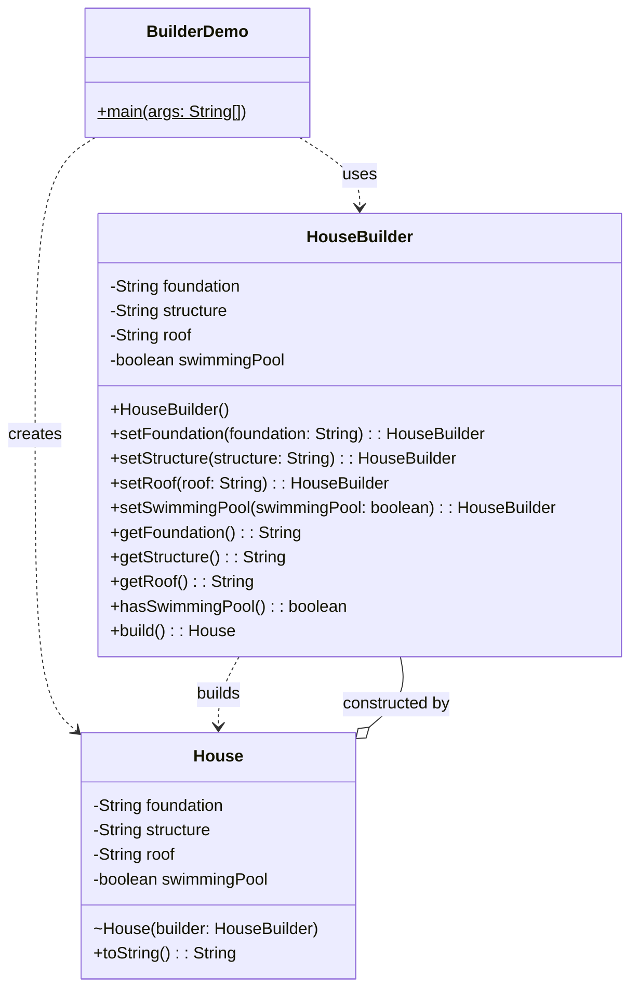
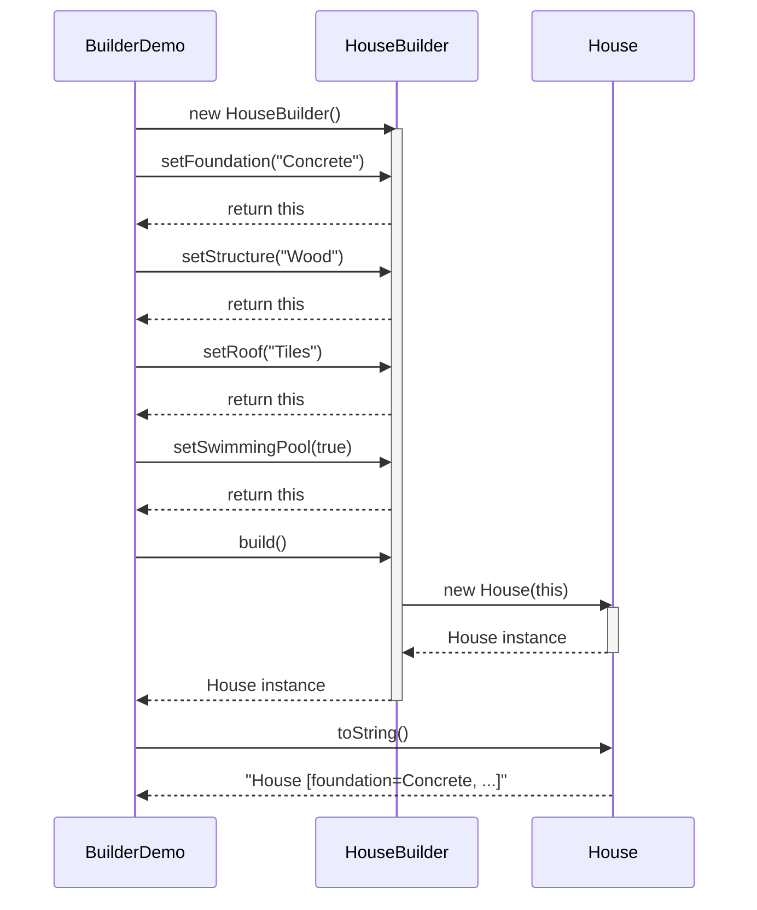
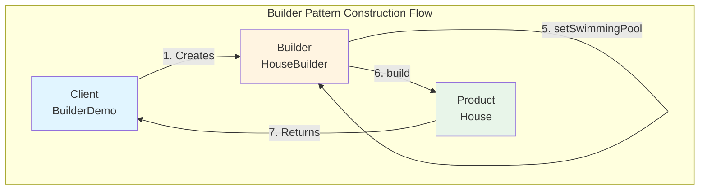
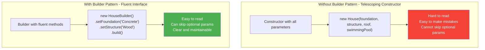
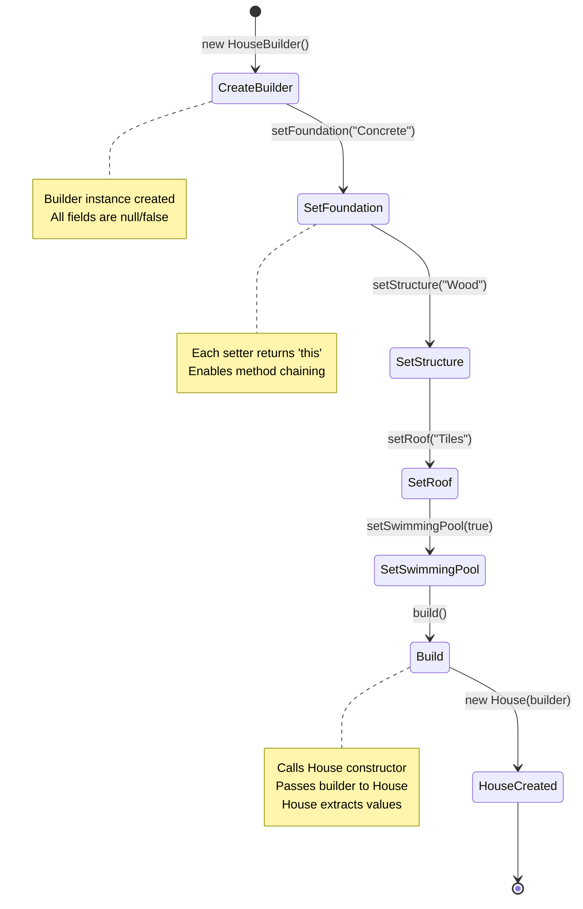
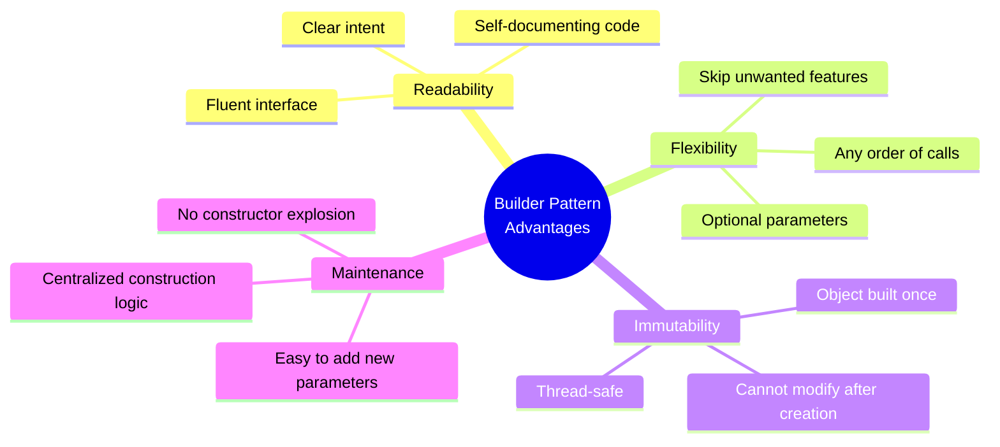
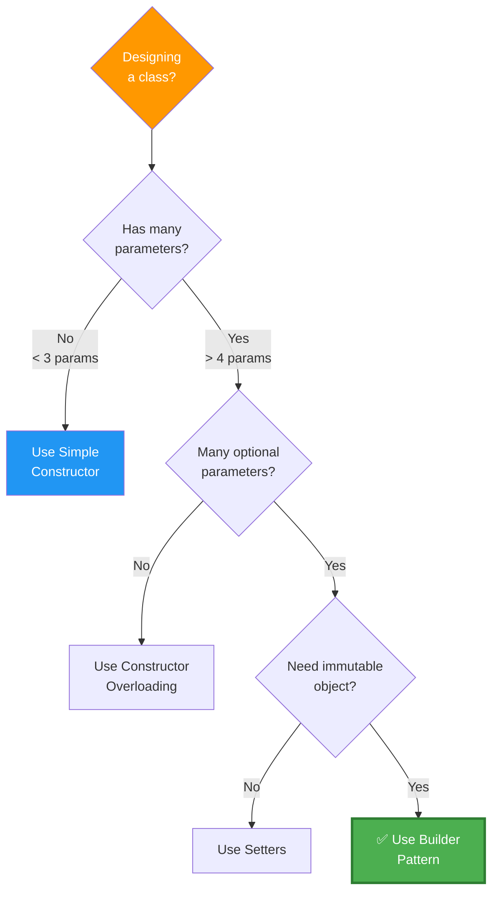
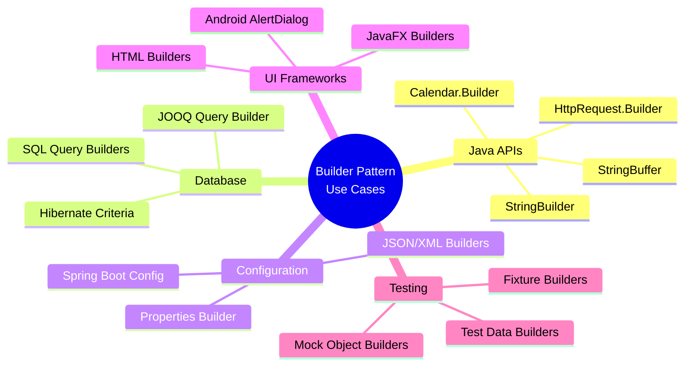
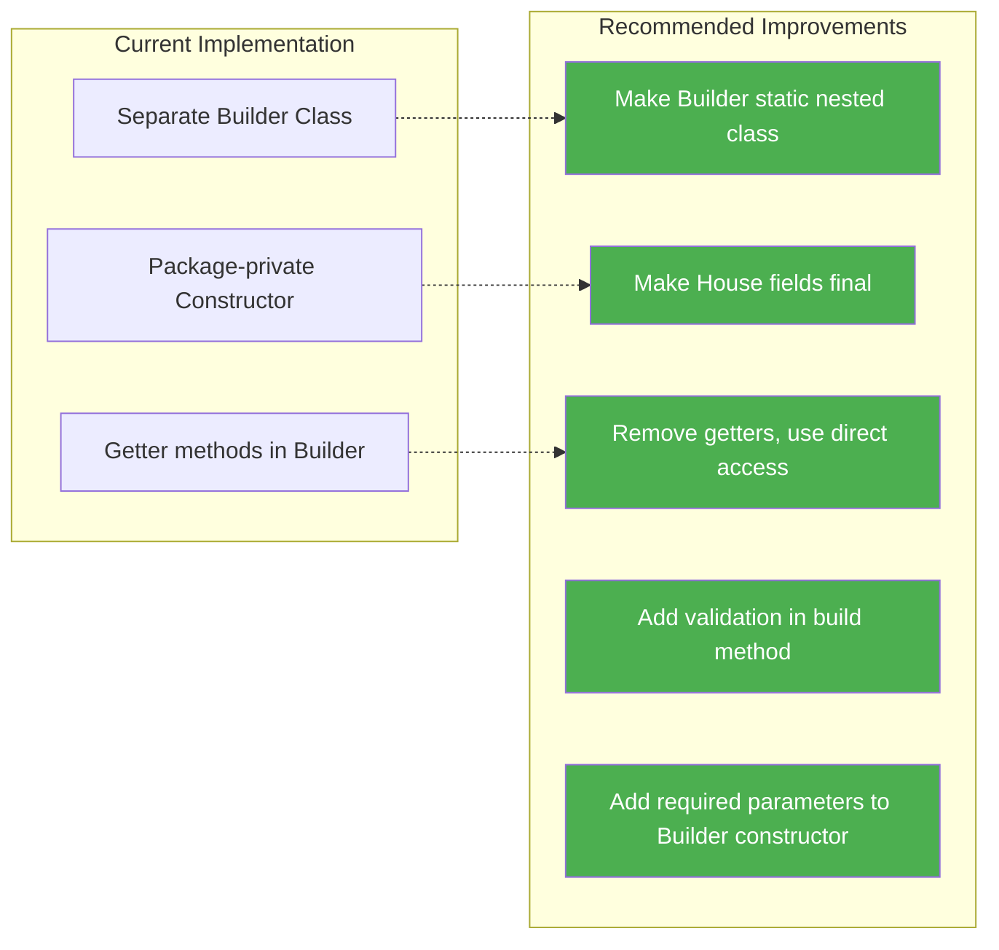

# Builder Design Pattern - UML Diagrams

## 1. Builder Pattern - Class Diagram



---

## 2. Sequence Diagram - Building a House



---

## 3. Builder Pattern Flow



---

## 4. Method Chaining Visualization


---

## 5. Object Creation Comparison



---

## 6. Design Explanation

### What is the Builder Pattern?

**Builder Pattern** is a creational design pattern that separates the construction of a complex object from its representation, allowing the same construction process to create different representations.

### Key Components

1. **Product (House)**: 
   - The complex object being built
   - Contains the fields: foundation, structure, roof, swimmingPool
   - Has a package-private constructor that only the Builder can access

2. **Builder (HouseBuilder)**:
   - Provides methods to construct parts of the Product
   - Each setter method returns `this` for method chaining
   - Contains the same fields as the Product
   - Has a `build()` method that creates the final Product

3. **Director/Client (BuilderDemo)**:
   - Uses the Builder to construct the object
   - Calls builder methods in desired order
   - Calls `build()` to get the final object

---

## 7. How Your Code Works

### Step-by-Step Process



---

## 8. Advantages & Disadvantages

### ✅ Advantages



### ❌ Disadvantages

| Disadvantage | Description |
|-------------|-------------|
| **More Code** | Need to create separate Builder class |
| **Complexity** | Overkill for simple objects |
| **Memory** | Two objects created (Builder + Product) |
| **Learning Curve** | Developers need to understand the pattern |

---

## 9. When to Use Builder Pattern



---

## 10. Real-World Examples

### Common Use Cases



---

## 11. Your Implementation Analysis

### Current Code Structure

**House.java** (Product):
```java
- Private fields (foundation, structure, roof, swimmingPool)
- Package-private constructor (accepts HouseBuilder)
- toString() method for display
```

**HouseBuilder.java** (Builder):
```java
- Same fields as House
- Public setter methods returning 'this'
- Getter methods for field access
- build() method creating House instance
```

**BuilderDemo.java** (Client):
```java
- Creates HouseBuilder instances
- Chains setter methods
- Calls build() to get House
- Demonstrates 5 different configurations
```

### Improvement Suggestions



---

## 12. Summary

### Builder Pattern Overview

| Aspect | Description |
|--------|-------------|
| **Pattern Type** | Creational |
| **Purpose** | Construct complex objects step by step |
| **Problem Solved** | Telescoping constructor problem |
| **Key Benefit** | Readable, flexible object creation |
| **Trade-off** | More code for better maintainability |
| **Best For** | Classes with 4+ parameters, many optional fields |

### Your Implementation

✅ **Working correctly** - Demonstrates all Builder pattern principles  
✅ **Method chaining** - Fluent interface implemented  
✅ **Separation of concerns** - Builder and Product are separate  
✅ **Flexible construction** - Can skip optional parameters  

---
